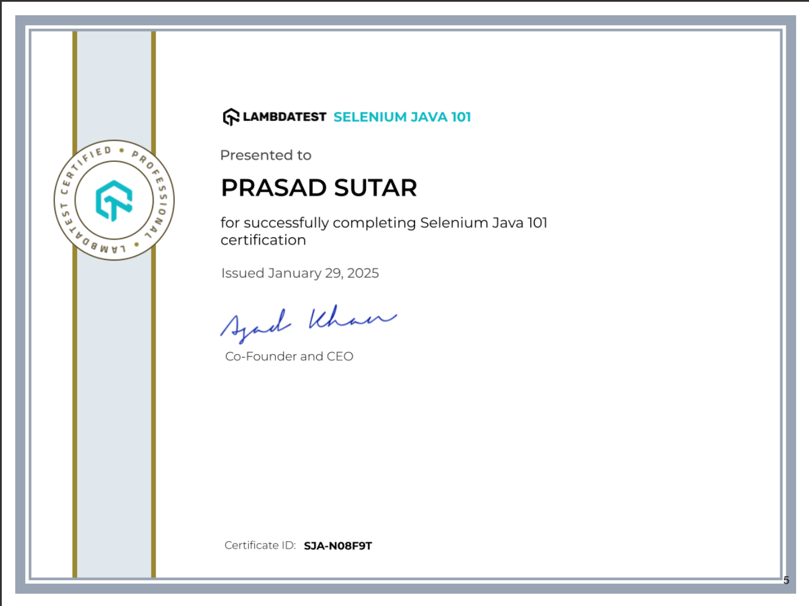
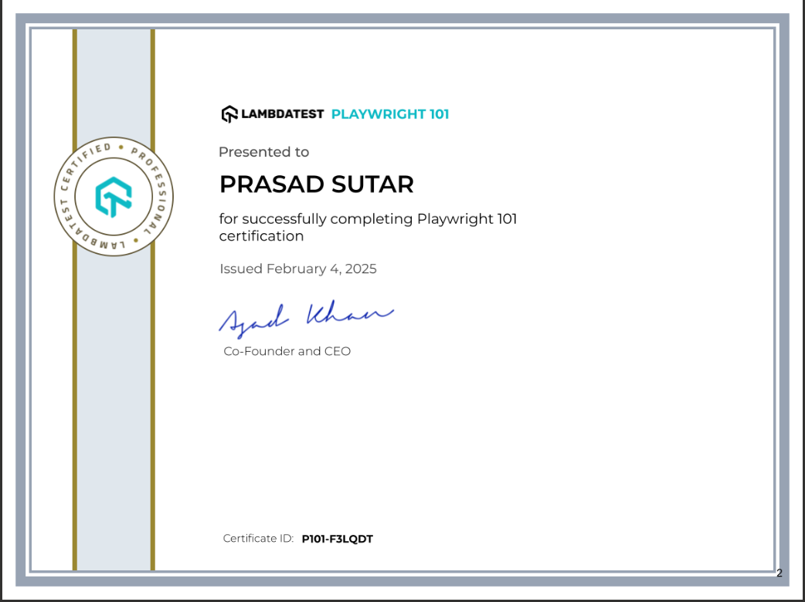
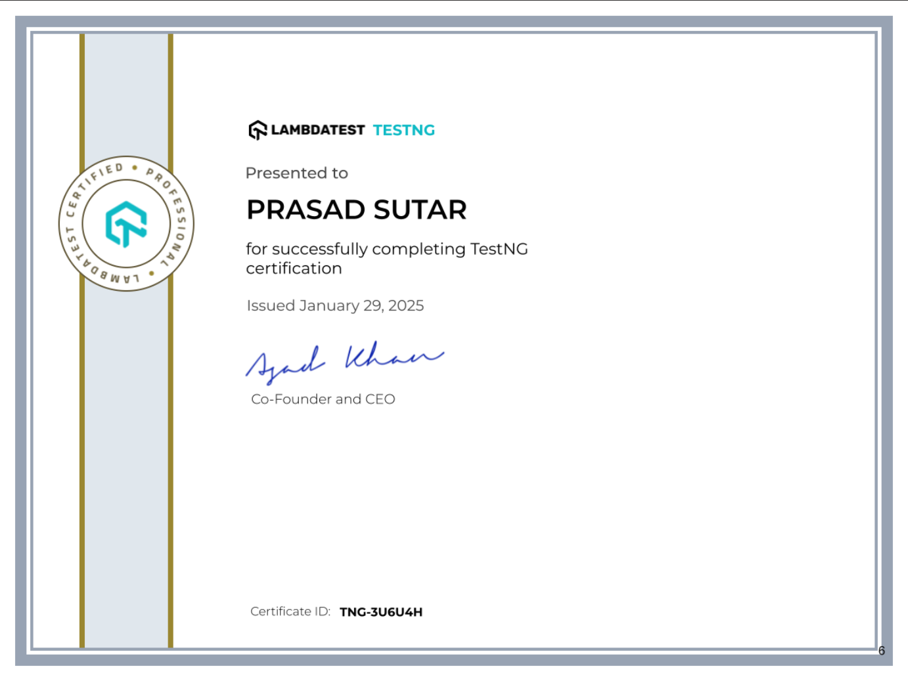
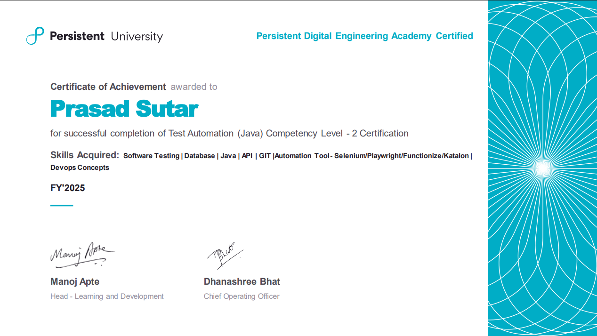
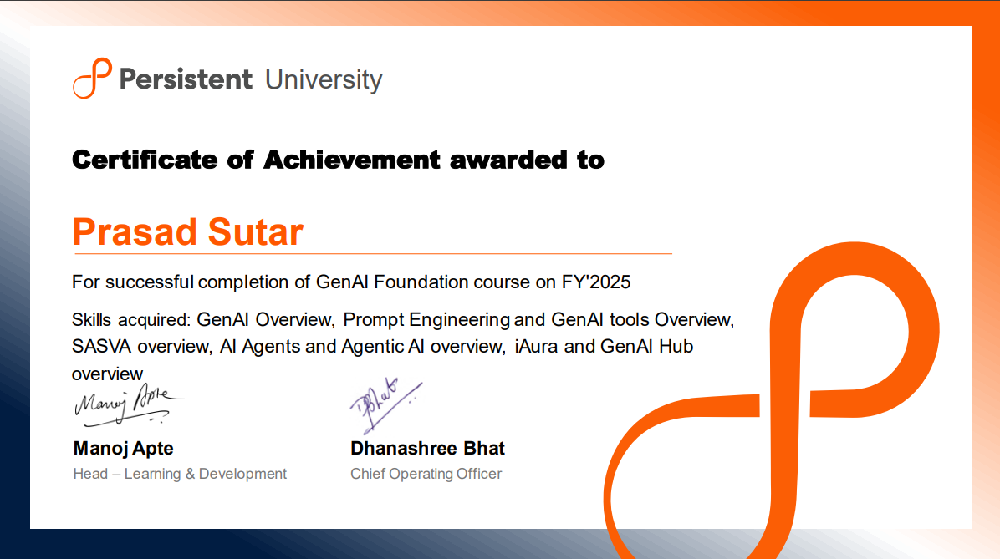
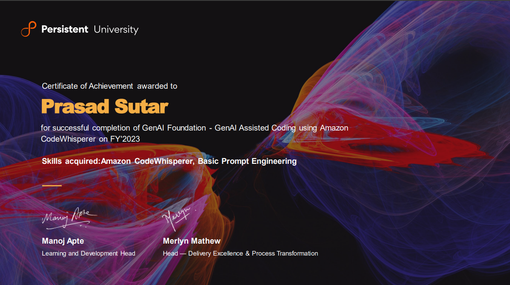
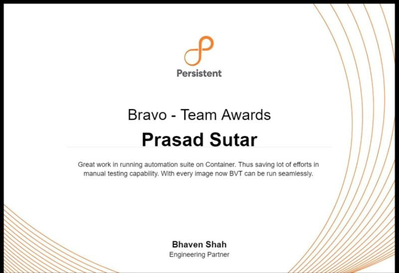
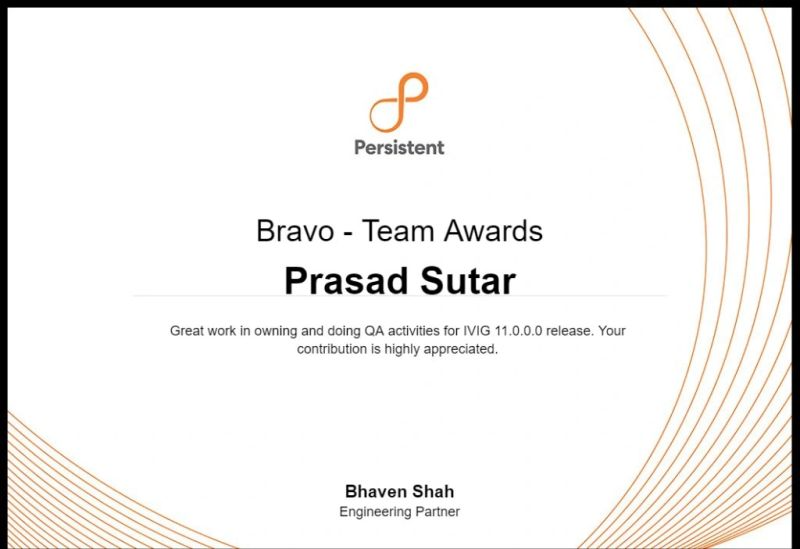
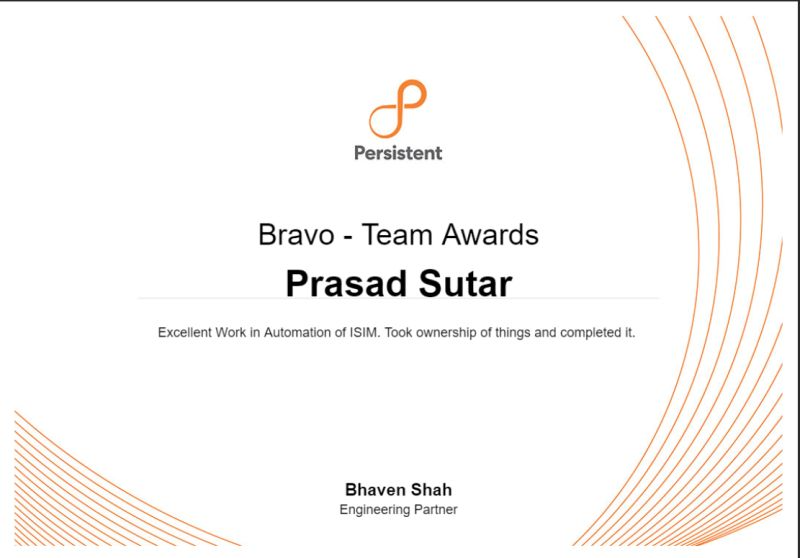
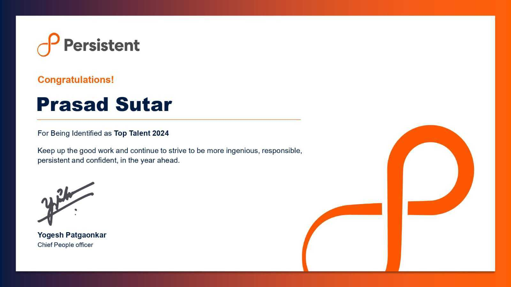

# My_AwardsAndCertifications

# 🏆 My Awards & Certifications

This document showcases key certifications and awards I've earned in test automation, Java development, and AI-assisted engineering.

---

## 🎓 Certifications

### ✅ Selenium Java 101 – LambdaTest (2024)

---

### ✅ Playwright 101 – LambdaTest (2024)

---

### ✅ TestNG Mastery – Core Java Testing

---

### ✅ Test Automation with Java – CL2 Internal Program

---

### ✅ GenAI Foundation Course (2025)

---

### ✅ GenAI-Assisted Coding using Amazon CodeWhisperer (2023)

---

## 🏅 Awards

### 🥇 Bravo Award – 2024

---

### 🥇 Bravo Award – 2025

---

### 🥈 Bravo Award – Q3 2024

---

### 🌟 Top Talent Recognition – 2024

---

## 💬 Why These Matter

These achievements reflect:

- Strong fundamentals in **Java-based automation frameworks**
- Proven knowledge of **Selenium**, **TestNG**, and **Playwright**
- Early adoption and practical use of **GenAI tools** like **Amazon CodeWhisperer**
- Recognition from organizations for excellence and innovation

---

## 📬 Contact

- 📧 Email: prasadsutar6544@gmail.com  
- 💼 LinkedIn: [linkedin.com/in/prasadsutar8400](https://www.linkedin.com/in/prasadsutar8400/)

---

_This list grows with each challenge I take. Thank you for viewing._
